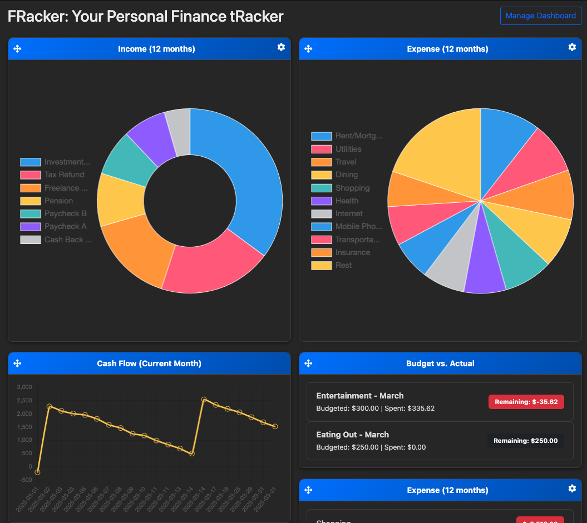
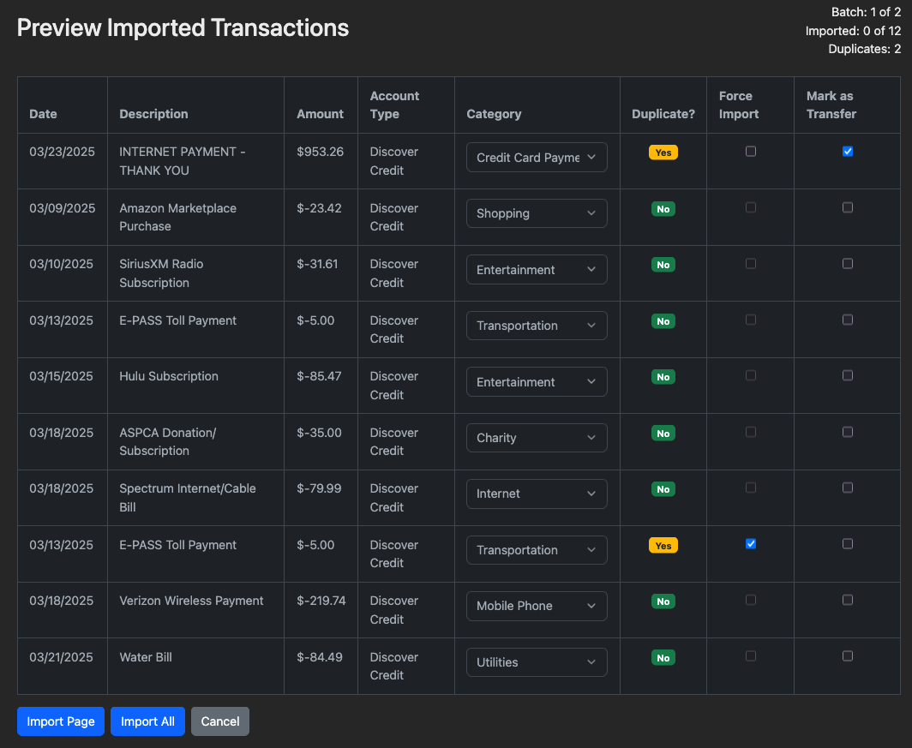
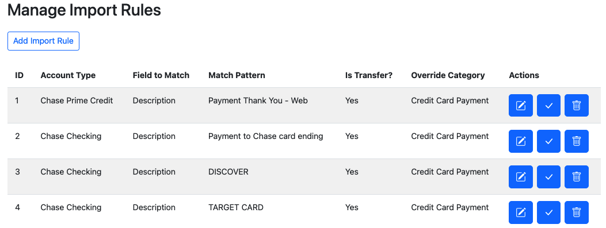

# FRacker - Your Personal Financial tRacker

[](LICENSE)
[](https://github.com/ahbergamo/finance_tracker/commits/main)
[](https://hub.docker.com/r/abergamo/finance-tracker)
[](https://ahbergamo.github.io/finance_tracker/)

A self-hosted personal finance tracking web application built with Flask.



Track expenses, categorize transactions, set budgets, and visualize your financial data—all securely hosted on your own server or Raspberry Pi.

---

## 🚀 Quick Start

```bash
# Clone the repository
git clone https://github.com/ahbergamo/finance_tracker.git
cd finance_tracker

# Configure environment
cp .env_default .env
# Edit .env with your settings

# Start with Docker
docker-compose up -d
```

Access FRacker at **http://localhost:1310**

📖 **[Full Installation Guide](https://ahbergamo.github.io/finance_tracker/getting-started/quick-start/)**

---

## ✨ Features

- 📊 **Interactive Dashboard** - Customizable charts with Chart.js
- 💳 **CSV Import** - Import transactions from any bank
- 🏷️ **Smart Categorization** - Automatic categorization with import rules
- 💰 **Budget Tracking** - Set and monitor monthly budgets
- 👨‍👩‍👧‍👦 **Multi-User Support** - Family accounts with shared finances
- 🔒 **Secure & Private** - Self-hosted, your data stays yours
- 🐳 **Easy Deployment** - Docker support for any platform

---

## 📚 Documentation

**Comprehensive documentation is available at:**

### **[ahbergamo.github.io/finance_tracker](https://ahbergamo.github.io/finance_tracker/)**

Quick links:
- [Installation Guide](https://ahbergamo.github.io/finance_tracker/getting-started/quick-start/)
- [Raspberry Pi Setup](https://ahbergamo.github.io/finance_tracker/getting-started/raspberry-pi/)
- [User Guide](https://ahbergamo.github.io/finance_tracker/user-guide/dashboard/)
- [Contributing](CONTRIBUTING.md)

---

## 🖼️ Screenshots

<details>
<summary>View Screenshots</summary>

### Dashboard


### Import Preview


### Import Rules


### Monthly Report


</details>

---

## 🤝 Contributing

We welcome contributions! See our [Contributing Guide](CONTRIBUTING.md) for details.

---

## 📜 License

This project is licensed under the [MIT License](LICENSE).

---

## ⚠️ Disclaimer

FRacker is a personal finance tracker intended for individual use. It is **not** a substitute for professional financial advice or accounting software.

---

## 💬 Support

- 📖 [Documentation](https://ahbergamo.github.io/finance_tracker/)
- 🐛 [Report Issues](https://github.com/ahbergamo/finance_tracker/issues)
- 💬 [Discussions](https://github.com/ahbergamo/finance_tracker/discussions)
