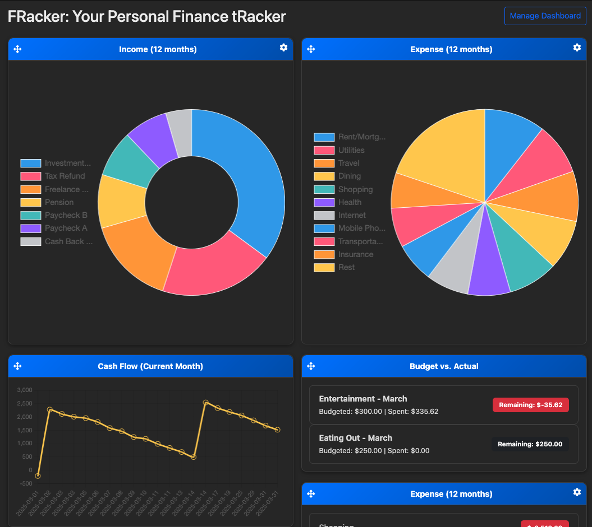

## FRacker - Your Personal Financial tRacker

A self-hosted personal finance tracking web application built with Flask.

<a href="screenshots/Dashboard.png">
  
</a>

Track expenses, categorize transactions, set budgets, and visualize your financial data—all securely hosted on your own server or Raspberry Pi.

## Features

- Import bank transactions via CSV
- Interactive dashboard with customizable charts (Chart.js)  
- Categorize expenses and income  
- Monthly budgeting per category  
- Multi-user family support (shared finances)  
- User authentication and password management  
- Import rule automation  
- Transaction filtering by date, type, account, and category  
- Easy deployment via Docker (Linux, Windows, Raspberry Pi)
- 📸 [Screenshots](#screenshots) of the dashboard and import views

---

## Quick Start with Docker🐳

1. Download the latest release bundle:

```bash
curl -s https://api.github.com/repos/ahbergamo/finance_tracker/releases/latest \
| grep "browser_download_url.*\\.tar\\.gz" \
| cut -d '"' -f 4 \
| xargs curl -L -o finance-tracker.tar.gz
```

> Or visit the [Releases](https://github.com/ahbergamo/finance-tracker/releases) page to download manually.

2. Copy `.env_default` to `.env` and update values as needed:

```bash
cp .env_default .env
```

3. Start the stack:

```bash
docker-compose up -d
```

> ℹ️ The app will be available at [http://localhost:1310](http://localhost:1310) or on your host's IP (e.g. `http://192.168.1.43:1310`).

---

## Prerequisites (for Manual Setup)

If you prefer not to use Docker, you’ll need:

- Python 3.10+
- MariaDB 10.5+ or MySQL
- Redis
- Node.js & npm (only if building front-end assets manually)

---

## Configuration

Environment variables are loaded from `.env` (automatically picked up by Docker Compose):

```env
SECRET_KEY=your_secure_key
DB_USER=finance_user
DB_PASSWORD=your_password
DB_PORT=3306
DB_NAME=finance_tracker
FLASK_CONFIG=config.config.PortableConfig
```

Use `.env_default` as a starting point.

>⚠️**Security Warning**  Never commit `.env`, `.env.prod`, or any file containing credentials, secrets, or keys. Use `.gitignore`, Docker secrets, or environment variables in production.

---

## Multi-Platform Docker Builds

Build and push Docker images for multiple platforms:

- App image: Tags include `${APP_VERSION}` and `latest`
- Nginx image: Tags include `nginx-${APP_VERSION}` and `nginx`

All images are built using `docker buildx` with `--platform linux/amd64,linux/arm64`.

Prebuilt images are available on Docker Hub for use with `docker-compose.yml` from each release.

---

## Security Notes

- Passwords are securely hashed using Werkzeug  
- Sessions are managed via Redis  
- CSRF protection enabled (Flask-WTF)  
- Nginx reverse proxy supports HTTPS (TLS certificate config required)  
- Avoid committing `.env` or `.env.prod` files with secrets

---

## Contributing

Want to help? Awesome!  
We follow a Git flow model with `main`, `develop`, and `release/*` branches. See [CONTRIBUTING.md](CONTRIBUTING.md#branching-strategy) for details.

Please read our [Contributing Guide](CONTRIBUTING.md) to get started.

---

## Screenshots

A few screenshots to show off the dashboard and import views:

### Dashboard
<a href="screenshots/Dashboard.png">
  
</a>  

The dashboard provides a quick overview of your financial health, including income and expense charts, recent activity, and category breakdowns.

### Import Preview
<a href="screenshots/Import_Preview.png">
  
</a> 

Preview your bank statement before importing. This screen shows a clean table view of transactions with automatic matching and parsing. Allows users to change or create a new category.

>**Note** Duplicate behavior

| Duplicate Type       | Behavior                                                                 | Force Import Default         |
|----------------------|--------------------------------------------------------------------------|------------------------------|
| **Same File Duplicate** | Marked as duplicate but allowed to be force-imported if necessary.        | Force Import option available. |
| **Database Duplicate**  | Identified as a duplicate based on existing records; manual confirmation is required to re-import. | Not allowed by default.      |

### Import Rules
<a href="screenshots/Import_Rules.png">
  
</a>  

Create and manage import rules to automatically categorize transactions based on keywords, merchants, or patterns.

### Monthly Report
<a href="screenshots/Monthly_Report.png">
  
</a>  

View detailed monthly summaries with charts for spending trends, income breakdowns, and category-level insights.

---

## Support & Feedback

To report bugs or request features, please [open an issue](https://github.com/ahbergamo/finance_tracker/issues).

For help or questions, use GitHub Discussions or contact the maintainer.

---

## Disclaimer

FRacker is a personal finance tracker intended for individual use.  
It is **not** a substitute for professional financial advice or accounting software.

---

## License

This project is licensed under the [MIT License](LICENSE). Have at it...

