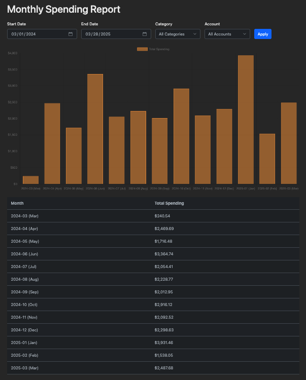

# Reports

FRacker provides several reports to help you analyze your financial data and make informed decisions.

## Available Reports

### Monthly Report

**Path:** Reports → Monthly Report

View detailed financial data for a specific month:

- Income vs. expense summary
- Category breakdown with charts
- Top spending categories
- Month-over-month comparisons
- Transaction details by category

**Use Cases:**
- Monthly budget review
- Expense tracking
- Identifying spending trends
- Planning next month's budget

### Annual Report

**Path:** Reports → Annual Report

Year-end financial summary:

- Total income and expenses for the year
- Monthly trend charts
- Category totals across all months
- Year-over-year comparisons
- Tax preparation data

**Use Cases:**
- Annual financial review
- Tax preparation
- Long-term trend analysis
- Setting next year's goals

### Income & Expense Report

**Path:** Reports → Income & Expense

Detailed breakdown of income and expenses:

- Side-by-side income and expense comparison
- Category-level detail
- Customizable date ranges
- Net income calculation
- Savings rate analysis

**Use Cases:**
- Cash flow analysis
- Understanding income sources
- Expense category analysis
- Financial planning

### Retirement Report

**Path:** Reports → Retirement

Track retirement savings and contributions:

- Retirement account balances
- Contribution history
- Employer match tracking
- Growth over time
- Account allocation

**Use Cases:**
- Retirement planning
- Contribution tracking
- Progress toward goals
- Account performance review

## Report Features

### Date Range Selection

All reports support flexible date filtering:

- **This Month** - Current month to date
- **Last Month** - Previous calendar month
- **Year to Date** - January 1st through today
- **Last Year** - Previous calendar year
- **Custom Range** - Any date range you specify

### Export Options

Export report data for further analysis:

1. View the report
2. Click **Export to CSV**
3. Open in Excel, Google Sheets, or other tools
4. Perform custom analysis

Exported files include:
- All transaction details
- Summary calculations
- Category breakdowns
- Date ranges

### Filtering

Refine reports with filters:

- **Category** - View specific categories only
- **Account** - Filter by account type
- **Transaction Type** - Income, expenses, or transfers
- **User** - Individual family member (for family accounts)

### Visualization

Reports include interactive charts:

- **Bar Charts** - Compare categories or time periods
- **Line Charts** - Track trends over time
- **Pie Charts** - Category distribution
- **Stacked Charts** - Combined category view

Charts support:
- Hover for details
- Click to filter
- Export as image
- Print-friendly views

## Using Reports Effectively

### Monthly Review Workflow

1. **Run Monthly Report** at month end
2. **Compare to Budget** - Check over/under budget categories
3. **Identify Patterns** - Look for unusual spending
4. **Note Anomalies** - One-time expenses vs. recurring
5. **Plan Next Month** - Adjust budgets based on findings

### Quarterly Analysis

1. **Run 3-Month Report** using custom date range
2. **Review Trends** - Are expenses increasing or decreasing?
3. **Seasonal Adjustments** - Account for seasonal variations
4. **Goal Progress** - Check progress toward financial goals

### Annual Planning

1. **Run Annual Report** in December/January
2. **Calculate Totals** - Total income, expenses, savings
3. **Identify Changes** - Year-over-year differences
4. **Set Goals** - Plan for next year based on data
5. **Tax Preparation** - Export data for tax filing

## Report Insights

### What to Look For

**In Monthly Reports:**
- Categories consistently over budget
- Unexpected large expenses
- Missing or incorrect transactions
- Opportunities to reduce spending

**In Annual Reports:**
- Overall savings rate
- Major expense categories
- Income growth
- Long-term spending trends

**In Income & Expense Reports:**
- Income diversity
- Fixed vs. variable expenses
- Discretionary spending percentage
- Net worth changes

### Red Flags

Watch for these warning signs:

- **Increasing Expenses** without income growth
- **Low Savings Rate** (< 10% of income)
- **High Discretionary Spending** (> 30% of income)
- **Irregular Income Patterns** without buffer savings
- **Growing Debt Balances**

### Positive Indicators

Signs of financial health:

- **Consistent Savings** (15-20% of income)
- **Controlled Spending** within budgets
- **Growing Net Worth** over time
- **Emergency Fund** building
- **Decreasing Fixed Expenses** as percentage of income

## Customizing Reports

### Custom Date Ranges

Create reports for any period:

1. Select "Custom Range" in date filter
2. Enter start and end dates
3. Click **Generate Report**

**Use Cases:**
- Tax year analysis (if different from calendar year)
- Project-specific tracking
- Comparison periods
- Post-major-event analysis

### Category Grouping

Group similar categories for clearer reports:

- Transportation (Gas + Public Transit + Parking)
- Food (Groceries + Dining Out)
- Housing (Rent/Mortgage + Utilities + Maintenance)

### Saved Report Configurations

While FRacker doesn't currently save report configurations, you can:

- Bookmark report URLs with parameters
- Document your standard report settings
- Create a monthly reporting checklist

## Troubleshooting

### Report Shows No Data

- Verify date range includes transactions
- Check filters aren't too restrictive
- Ensure transactions are properly imported
- Confirm you're viewing correct account/family

### Incorrect Totals

- Check for duplicate transactions
- Verify transfers aren't counted as income/expense
- Review uncategorized transactions
- Ensure all transactions are in selected date range

### Charts Not Displaying

- Refresh the page
- Clear browser cache
- Check that JavaScript is enabled
- Try a different browser

### Export Issues

- Ensure pop-up blocker allows downloads
- Check disk space for large exports
- Try exporting smaller date ranges
- Use CSV format if Excel export fails

## Next Steps

- [Set Up Budgets](categories-budgets.md#budgets) to track against
- [Create Categories](categories-budgets.md#categories) for better organization
- [Import More Data](importing-transactions.md) for comprehensive reports
- [Configure Account Types](../getting-started/configuration.md#account-types) for accurate categorization
